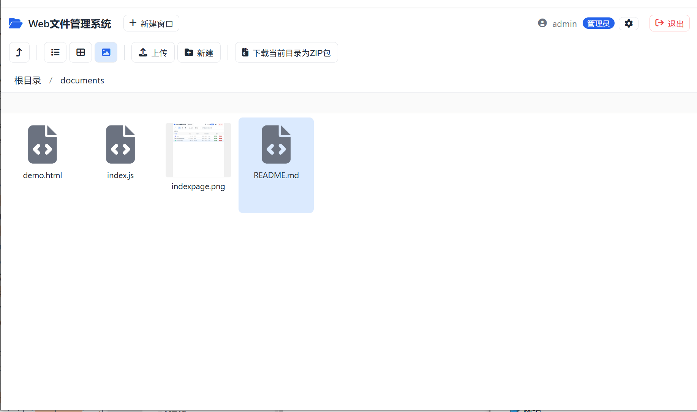

# Web 文件管理系统

一个基于 PHP + 原生 JavaScript 的轻量级 Web 文件管理系统，提供类桌面（MDI 多窗口）的文件管理体验，支持文件预览、上传、下载、压缩包导出、操作日志审计等。



## 功能特性

### 文件操作
- 目录浏览（文件夹优先排序，支持名称/大小/类型/日期排序）
- 新建文件夹、重命名、删除（支持递归删除非空目录）
- 复制 / 剪切 / 粘贴（含重名自动加序号）
- 单文件下载、多文件/目录 ZIP 流式压缩下载（PHP 8 原生 `ZipArchive`）

### 文件预览
- 图片：集成 [Viewer.js](https://github.com/fengyuanchen/viewerjs)，支持缩放/旋转/全屏
- 视频：`<video>` 内联播放（mp4/mkv/avi/webm/mov/wmv/flv）
- 音频：`<audio>` 内联播放（mp3/wav/flac/ogg/aac）
- 文本：代码/配置文件预览（txt/html/css/js/json/xml/toml/md/ini/yaml/csv/log 等）
- 图片自动返回宽高信息

### 界面交互
- **多窗口 MDI**：背景窗口 + 可拖拽/可调整大小/可最大化的浮动窗口
- **三种视图**：详细列表、图标、大图标（图片显示缩略图）
- **右键菜单**：根据上下文（空白/文件/文件夹/多选）动态生成
- **拖拽**：文件项拖入文件夹移动；本地文件拖入窗口上传
- **框选**：空白区域鼠标拖拽框选多个文件
- **面包屑导航**：支持点击跳转、点击空白编辑路径
- **快捷键**：`Ctrl+A` 全选、`Ctrl+C/X/V` 复制剪切粘贴、`Delete` 删除、`F2` 重命名
- **上传面板**：多文件并发上传，实时进度，可取消

### 安全与管理
- 用户登录认证（Session + Cookie Token 双模式，支持「保持登录」60 天免登录）
- 多用户/角色（admin / normal，通过 TOML 配置）
- 路径穿越防护（`file_safepath` 手动解析 `..`，禁止越出根目录）
- 禁止上传/列表显示 `.php` 文件
- 操作日志审计（登录/上传/下载/删除/重命名/复制/剪切/打包），含用户、IP、时间，支持分页查询

## 技术栈

| 层 | 技术 |
| --- | --- |
| 后端 | PHP 5.5+（`ZipArchive`、`PDO`、`openssl`） |
| 数据库 | SQLite（PDO，自动建表，零配置） |
| 配置 | TOML（[leonelquinteros/php-toml](https://github.com/leonelquinteros/php-toml)） |
| 前端 | 原生 JavaScript（IIFE 模块，无框架） |
| 图片预览 | Viewer.js 1.11.6 |
| 图标 | Font Awesome |

## 目录结构

```
.
├── index.php          # 入口：路由分发 + 主页面 HTML
├── login.php          # 登录页面 + 登录验证 API
├── app.js             # 前端全部逻辑（工具函数 / 窗口 / 右键 / 上传 / 预览 / 日志）
├── style.css          # 全局样式
├── config.toml        # 用户与站点配置
├── composer.json      # 依赖声明
├── lib/
│   ├── init.php       # 公共初始化（时区/自动加载/常量）
│   ├── conf.php       # TOML 配置解析
│   ├── db.php         # SQLite 封装（params/logs/auth_tokens 三表）
│   ├── auth.php       # 认证（登录/登出/Token 保持登录）
│   ├── file.php       # 文件操作 API（含路径安全过滤）
│   ├── up.php         # 上传处理（多文件、禁 PHP）
│   ├── down.php       # 下载 + ZIP 流式压缩
│   └── log.php        # 操作日志记录与查询
├── viewer1.11.6/      # Viewer.js 资源
├── vendor/            # Composer 依赖
└── documents/         # 截图等文档
```

## 安装与运行

### 环境要求
- PHP 8.0 及以上（需启用 `pdo_sqlite`、`zip` 扩展）
- Web 服务器（Apache / Nginx / IIS，或直接用 PHP 内置服务器）

### 步骤
1. 克隆仓库到 Web 服务器根目录：
   ```bash
   git clone <repo-url>
   ```
2. 安装依赖（若已包含 `vendor/` 可跳过）：
   ```bash
   composer install
   ```
3. 准备 Font Awesome（`fontawesome/css/all.min.css`），放置于项目根目录（已在 `.gitignore` 中忽略）。
4. 创建文件存储目录 `up/`（已忽略，需自行创建并保证 Web 进程可读写）：
   ```bash
   mkdir up
   chmod 755 up
   ```
5. 访问 `http://localhost/` 即可。

### 快速试用（PHP 内置服务器）
```bash
php -S 127.0.0.1:8000
```
浏览器打开 `http://127.0.0.1:8000/`，使用默认账号登录：

| 用户名 | 密码 | 角色 |
| --- | --- | --- |
| `admin` | `123456` | 管理员 |
| `user` | `123456` | 普通用户 |

> 首次运行会自动创建 `data.db`（SQLite）并建表。请务必在生产环境修改 `config.toml` 中的默认密码。

## 配置说明

`config.toml`：

```toml
[system]
site_name = "Web文件管理系统"

[[users]]
name = "admin"
pass = "123456"
level = "admin"

[[users]]
name = "user"
pass = "123456"
level = "normal"
```

- `site_name`：站点名称
- `[[users]]`：用户数组，每个用户包含 `name`（用户名）、`pass`（密码）、`level`（`admin` 或 `normal`）

## API 一览

所有接口统一由 `index.php?act=xxx` 分发，返回 JSON。

| act | 方法 | 说明 |
| --- | --- | --- |
| `list` | GET | 列出目录内容 |
| `info` | GET | 获取文件/目录详情 |
| `read` | GET | 读取文本文件内容 |
| `down` | GET | 下载单个文件 |
| `zip` | GET | 多文件/目录 ZIP 打包下载 |
| `mkdir` | POST | 新建文件夹 |
| `del` | POST | 删除文件/目录 |
| `ren` | POST | 重命名 |
| `paste` | POST | 粘贴（复制/剪切） |
| `upload` | POST | 上传文件（multipart） |
| `log` | GET | 查询操作日志（分页 + 过滤） |

## 安全注意事项

- 默认密码仅用于演示，**生产环境务必修改**。
- 文件存储根目录 `up/` 不可执行 PHP（系统已禁止上传 `.php` 并在列表中隐藏）。
- 建议在 Web 服务器层面进一步禁止 `up/` 目录的 PHP 解析。
- `data.db` 与 `config.toml` 建议通过 Web 服务器配置禁止外部访问。

## 许可

本项目仅供学习与内部使用。
